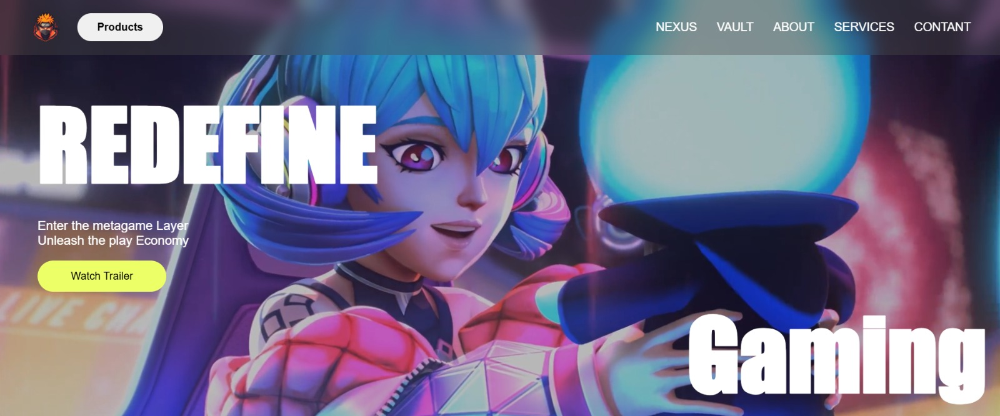

<p align="center">
  
</p>

<h1 align="center"> GamingGalaxy</h1>
<p align="center">
  A futuristic, anime-inspired gaming portal with cinematic visuals, immersive UI, and responsive design.<br />
  Where gaming meets style.
</p>

<p align="center">
  <a href="https://github.com/AdanSultan/GamingGalaxy" target="_blank">
    
    
    
    
  </a>
</p>

---


##  Features

-  **Dynamic Hero Section**  
  Seamlessly cycle through cinematic hero videos.

-  **Vibrant Product Cards**  
  Discover platforms like Radiant, ZIGMA, NEXUS, and AZUL, each with unique videos & descriptions.

-  **Immersive Visuals**  
  Dive into high-quality images, looping video previews, and anime-style themes.

-  **Responsive Design**  
  Sleek, mobile-first layout that adapts to all screen sizes.

-  **Engaging Footer**  
  Includes newsletter signup, social links, and contact options.

---

##  Project Structure

```bash
GamingGalaxy/
│
├── img/           # Images, icons, logo
├── videos/        # Hero and product videos
├── index.html     # Main HTML
├── style.css      # Styles (animations, layout, colors)
├── script.js      # Interactivity (hero switching, etc.)
└── README.md      # You're reading it

```


